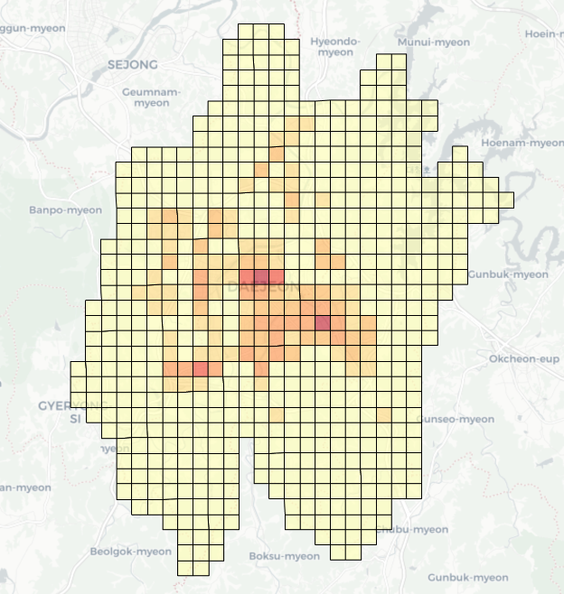
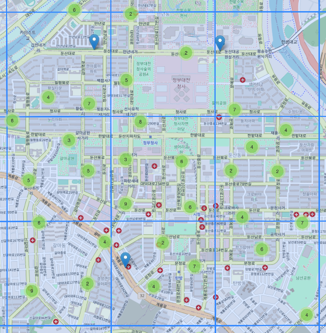
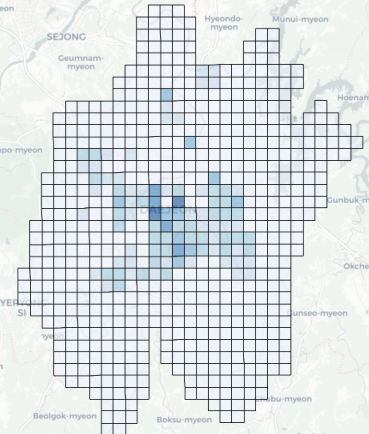
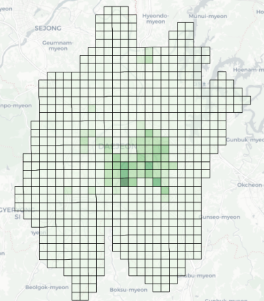
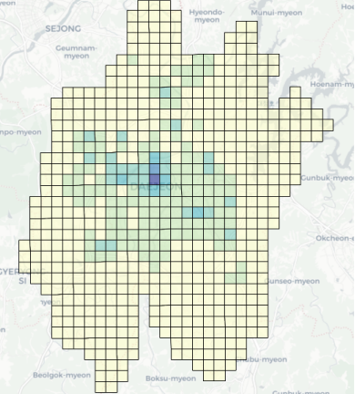
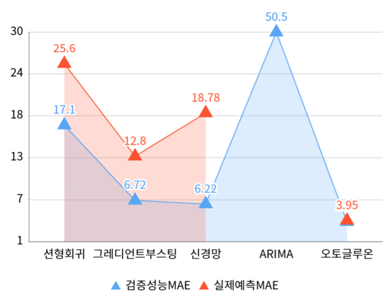
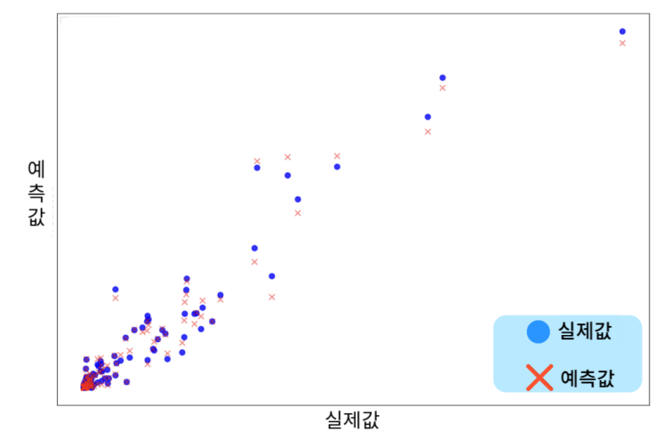

# 대전시 대중교통 통행수요 예측 프로젝트

## 📌 프로젝트 소개
본 프로젝트는 2023년 지역사회 문제해결형 빅데이터/AI활용 공모전의 일환으로, 대전시 대중교통 통행수요를 예측하는 모델을 개발했습니다.

## 📦 모델 다운로드

### 학습된 모델 파일
- **모델명**: WeightedEnsemble_L2 (AutoGluon)
- **파일 크기**: xxx MB
- **Google Drive**: [모델 다운로드 링크](https://drive.google.com/drive/folders/1GmP3VaZZl9xJGvJBrfgQUjb_C4x1Vomi?usp=sharing)

### 모델 정보
- **프레임워크**: AutoGluon 0.8.2
- **Python 버전**: 3.10.12
- **학습 데이터 기간**: 2023-06-01 ~ 2023-08-24
- **MAE 성능**: 3.89

### 주의사항
- 모델 파일의 용량이 크므로 충분한 저장 공간 확보 필요
- AutoGluon 0.8.2 버전 이상 설치 필요
- 예측 시 입력 데이터는 학습 데이터와 동일한 형식 필요

## 📊 데이터 구조
### 기본 정보
- **수집 기간**: 2023-06-01 ~ 2023-08-24
- **시간 단위**: 0시 ~ 23시 (시간별)
- **위치 정보**: GID (격자번호)

### 주요 변수
- **GID**: 격자번호
- **DATE**: 일자
- **TIME**: 시간(시)
- **RIDE_DEMAND**: 승차 수요 (Target Variable)
- **ALIGHT_DEMAND**: 하차 수요

## 💻 데이터 예시
| gid      | DATE       | TIME | RIDE_DEMAND | ALIGHT_DEMAND |
|----------|------------|------|-------------|---------------|
| 다마9599 | 2023-06-01 | 5    | 1           | 0             |
| 다마9599 | 2023-06-01 | 6    | 2           | 5             |
| 다마9599 | 2023-06-01 | 7    | 2           | 7             |

## 📑 활용 데이터
모델의 예측 성능 향상을 위해 다음과 같은 외부 데이터를 활용했습니다:

### 1. 정류장대기데이터
- **출처**: 공공데이터포털
- **내용**: 격자별 버스정류장 개수
- **활용**: 지역별 대중교통 접근성 파악

### 2. 국토데이터
- **출처**: 국토정보 플랫폼
- **내용**: 격자별 인구, 빌딩 수, 용적률
- **활용**: 지역 특성 및 유동인구 추정

### 3. 날씨데이터
- **출처**: 기상청
- **내용**: 온도와 강수량
- **활용**: 기상 조건에 따른 수요 변화 분석

## 🔄 데이터 통합 프로세스
1. 격자 단위(GID)로 데이터 통합
2. 시간대별 데이터 매칭
3. 결측치 처리 및 이상값 제거

## 🚏 추가 특성: 버스정류장 데이터 (bus_count)

### 데이터 특성
- **변수명**: bus_count
- **의미**: 각 격자(GID)에 존재하는 버스정류장의 개수
- **특징**: 지역별 대중교통 접근성 지표

### 데이터 시각화

  
  

### 주요 특징
- 격자 기반 공간 데이터 구조 활용
- 각 격자별 버스정류장 수 정량화
- 대중교통 수요 예측을 위한 핵심 변수로 활용

### 데이터 처리 과정
1. 격자별 버스정류장 위치 매핑
2. 격자당 정류장 개수 집계
3. 메인 데이터셋과 GID 기준 병합

## 🏢 추가 특성: 국토데이터

### 격자별 국토 정보
1. **총 인구**
   - 격자별 거주 인구수
   - 히트맵으로 시각화한 인구 밀집도

2. **빌딩 수**
   - 격자별 건물 개수
   - 도시 개발 밀집도 파악

3. **용적률**
   - 격자별 건물 용적률
   - 도시 개발 강도 지표

### 데이터 시각화

  
  
  

### 활용 목적
- 지역별 유동인구 추정
- 상업/주거 지역 구분
- 대중교통 수요와 도시 개발 상관관계 분석

## 📊 상관관계 분석

### RIDE_DEMAND와 변수들 간의 상관계수
- **ALIGHT_DEMAND**: 0.91 (가장 높은 상관관계)
- **bus_count**: 0.58
- **floor_area_ratio**: 0.55
- **old_population**: 0.50
- **total_population**: 0.49
- **working_population**: 0.49
- **total_building**: 0.49
- **building_to_land_ratio**: 0.38
- **기온(°C)**: 0.08
- **TIME**: 0.06

### 주요 발견점
1. **하차 수요(ALIGHT_DEMAND)와 강한 상관관계**
   - 0.91의 매우 높은 양의 상관관계
   - 승하차 수요가 서로 밀접하게 연관됨

2. **인프라 관련 변수들의 중간 정도 상관관계**
   - 버스정류장 수(bus_count): 0.58
   - 용적률(floor_area_ratio): 0.55

3. **인구 관련 변수들의 유사한 상관성**
   - 노인인구, 총인구, 근로인구 모두 약 0.5의 상관계수
   - 인구 특성이 승차 수요에 비슷한 영향력 보유

4. **기상 조건과 시간의 낮은 상관성**
   - 기온과 시간은 0.1 미만의 낮은 상관관계
   - 직접적인 영향력이 상대적으로 적음

## 📉 하차 데이터(ALIGHT_DEMAND) 공간 분석

### 하차 수요 분포 시각화
- **격자별 히트맵 구현**
  - 전체 대전시 지역을 격자로 분할
  - 하차 수요를 색상 강도로 표현

### 주요 발견점
1. **중심부 집중 현상**
   - 대전역 주변 격자에서 높은 하차 수요 발생
   - ID: 다마8917 지역에서 최대 하차 수요(1,259,214) 기록

2. **공간적 특성**
   - 도심 지역에서 높은 하차 수요
   - 외곽으로 갈수록 하차 수요 감소
   - 특정 격자에 하차 수요가 집중되는 현상 관찰

3. **활용 방안**
   - 하차 수요 집중 지역 파악으로 버스 노선 최적화 가능
   - 시간대별 하차 수요 패턴 분석에 활용
   - 대중교통 인프라 확충 계획 수립에 참고 자료로 활용

## 📅 요일별 하차 수요 분석

### 요일별 하차 수요 패턴
- **평일(월-금)**: 16,800 ~ 18,000명 수준 유지
- **토요일**: 약 13,000명으로 급감
- **일요일**: 약 9,000명으로 최저치 기록

### 주요 발견점
1. **최다 하차 지역**
   - 다마8917(둔산동 갤러리아 부근) 지역이 최다 하차 수요 기록
   - 상업지구 특성이 반영된 결과

2. **뚜렷한 주말 효과**
   - 평일 대비 주말 하차 수요 급감
   - 토요일: 평일 대비 약 30% 감소
   - 일요일: 평일 대비 약 50% 감소

3. **시간 특성 활용**
   - TIME 변수를 이용해 주말을 1, 주중을 0으로 변환
   - 요일 특성을 이진 분류로 단순화하여 모델링에 활용

## 🤖 모델 선택 및 성능 비교

### 모델별 성능 비교

  

### AutoGluon 선택 이유
1. **우수한 성능**
   - 가장 낮은 MAE 점수(3.95) 기록
   - 다른 모델들 대비 현저히 우수한 예측 정확도

2. **AWS 환경 최적화**
   - 머신러닝을 자동화하여 간단한 코드로 최적의 모델 선택
   - 예측이 용이한 환경 제공

3. **자동 모델 선택**
   - 여러 종류의 모델을 학습하여 스코어를 측정
   - 가장 좋은 모델을 자동으로 선택

4. **효율적인 학습 과정**
   - 오토글루온을 사용하여 분리한 트레인 셋에 대한 예측을 해본결과 만족스러운 값을 획득

### 기타 시도 모델
- 선형회귀, 그래디언트 부스팅, 신경망, ARIMA 등 시도
- 실제예측에서 만족할 만한 결과를 얻지 못함

## 📊 데이터셋 분할

### 분할 상세
1. **전체 데이터 (100%)**
   - 수집된 모든 대전시 대중교통 통행 데이터

2. **학습 데이터 (80%)**
   - 모델 학습에 사용되는 트레인 셋
   - 전체 데이터의 80% 할당

3. **테스트 데이터 (20%)**
   - 모델 성능 평가용 테스트 셋
   - 전체 데이터의 20% 무작위 추출

### 분할 전략
- 전체 데이터셋 중 20%를 무작위 추출하여 테스트 셋으로 활용
- 시계열 데이터의 특성을 고려한 분할 방식 적용
- 데이터 불균형 문제 방지를 위한 stratified sampling 적용

## 🔧 AutoGluon 모델 설정

### 모델 초기화 및 학습

### 주요 설정 사항
1. **타겟 변수**
   - RIDE_DEMAND(승차 수요)를 예측 대상으로 설정

2. **평가 지표**
   - MAE(Mean Absolute Error) 사용
   - 실제 값과 예측 값의 절대 오차 평균
   - 직관적인 해석이 가능한 지표

3. **학습 데이터**
   - train_set을 사용하여 모델 학습 진행

## 🔄 AutoGluon 학습 환경 및 데이터 정보

### 시스템 환경
- **AutoGluon 버전**: 0.8.2
- **Python 버전**: 3.10.12
- **운영체제**: Linux
- **플랫폼**: x86_64
- **디스크 공간**: 204.31 GB / 242.49 GB (84.3% 사용 가능)

### 학습 데이터 구조
- **데이터 크기**: xxx,xxx rows
- **특성 수**: 17 columns
- **타겟 변수**: RIDE_DEMAND

### 모델 저장 경로
- AutogluonModels/ag-20231122_153440/

### 학습 데이터 특징
- 대규모 시계열 데이터 (xx만여 건)
- 17개의 예측 변수 활용
- 승차 수요(RIDE_DEMAND)를 타겟으로 설정

## 📊 문제 유형 설정

### AutoGluon의 문제 유형 인식
- **문제 유형**: 회귀(Regression)
- **판단 근거**: 타겟 변수(RIDE_DEMAND)의 데이터 타입이 정수형이며, 다양한 값이 관찰됨

### 타겟 변수(RIDE_DEMAND) 특성
- **최대값**: x,xxx
- **최소값**: x
- **평균**: xx.xxxxx
- **표준편차**: xxx.xxxxx

### 모델 학습 방향
1. **회귀 문제로 접근**
   - 연속적인 숫자값 예측
   - 정수형 타겟 변수의 특성 반영

2. **자동 학습 설정**
   - AutoGluon이 데이터 특성을 자동으로 파악
   - 최적의 회귀 모델 선택 및 학습

## 🔄 AutoMLPipeline 전처리 과정

### 시스템 리소스
- **가용 메모리**: 35389.48 MB
- **학습 데이터 사용 메모리**: 207.1 MB (가용 메모리의 0.6%)

### 성능 지표
- **검증 점수**: -25.9107 (mean_absolute_error)
- **학습 시간**: 2.34초
- **검증 시간**: 0.14초

### AutoMLPipelineFeatureGenerator 특징
1. **자동 생성된 전처리 파이프라인**
   - 데이터 타입 자동 추론 및 처리
   - 각 특성별 메타데이터 설정

2. **데이터 변환 프로세스**
   - Stage 1 Generator를 통한 데이터 전처리
   - AsTypeFeatureGenerator를 활용한 데이터 타입 변환
   - 모델 학습에 적합한 형태로 데이터 변환

3. **효율적인 메모리 관리**
   - 전체 가용 메모리의 0.6%만 사용
   - 빠른 학습 및 검증 시간 달성

## 🤖 모델 학습 결과

### 모델별 성능 비교
1. **RandomForestMSE**
   - Validation score (MAE): -4.3784
   - Training runtime: 51.18s
   - Validation runtime: 0.13s

2. **CatBoost**
   - Validation score (MAE): -4.5041
   - Training runtime: 629.59s
   - Validation runtime: 0.02s

3. **ExtraTreesMSE**
   - Validation score (MAE): -4.3871
   - Training runtime: 21.38s
   - Validation runtime: 0.14s

4. **NeuralNetFastAI**
   - Validation score (MAE): -5.251
   - Training runtime: 348.47s
   - Validation runtime: 0.06s

5. **XGBoost**
   - Validation score (MAE): -4.3108
   - Training runtime: 93.18s
   - Validation runtime: 0.37s

6. **NeuralNetTorch**
   - Validation score (MAE): -6.6874
   - Training runtime: 662.58s
   - Validation runtime: 0.04s

### 주요 특징
- AutoGluon이 다양한 모델을 자동으로 학습하고 평가
- 성능이 우수한 모델을 자동으로 선택하여 최종 모델 생성
- 파라미터 튜닝은 AutoGluon이 자동으로 수행하여 별도의 수동 튜닝이 불필요

## 📊 최종 모델 성능 결과

### 모델별 MAE 점수 비교
| 순위 | 모델명 | MAE 점수 |
|-----|--------|----------|
| 1 | WeightedEnsemble_L2 | -3.767851 |
| 2 | LightGBMLarge | -3.799501 |
| 3 | LightGBM | -3.941260 |
| 4 | LightGBMXT | -4.035391 |
| 5 | XGBoost | -4.310765 |
| 6 | RandomForestMSE | -4.378352 |
| 7 | ExtraTreesMSE | -4.387135 |
| 8 | CatBoost | -4.504140 |
| 9 | NeuralNetFastAI | -5.251002 |
| 10 | NeuralNetTorch | -6.687414 |
| 11 | KNeighborsDist | -25.910665 |
| 12 | KNeighborsUnif | -26.604034 |

### 주요 결과
- **최고 성능 모델**: WeightedEnsemble_L2
  - MAE 점수: -3.7679
  - 여러 모델의 예측을 가중 평균하여 최종 예측을 생성하는 앙상블 모델
- **앙상블 효과**: 단일 모델들보다 더 우수한 성능을 보여줌
- **모델 선택**: AutoGluon이 자동으로 최적의 모델을 선택하고 앙상블 구성

## 📈 모델 성능 평가

### 검증 성능과 실제 예측 비교
- **검증 성능 MAE**: 3.77
- **실제 예측 MAE**: 3.95
- **성능 차이**: MAE 0.18 상승
  - 실제 예측에서 MAE값이 두 배 이상 상승하면 오버피팅으로 판단
  - 현재 모델은 오버피팅이 아닌 것으로 확인

### 예측값 처리 과정 및 성능 개선
1. **음수값 처리**
   - 예측값에서 발생한 음수값을 0으로 변환
   - MAE 3.95 → 3.93 (0.02 감소)

2. **소수점 처리**
   - 소수점 6째자리까지 있는 예측값을 반올림하여 정수로 변환
   - MAE 3.93 → 3.89 (0.04 추가 감소)

3. **최종 성능 개선**
   - 초기 MAE: 3.95
   - 최종 MAE: 3.89
   - **총 MAE 0.06 감소**

### 주요 시사점
- 예측값의 후처리를 통해 모델 성능을 추가로 개선할 수 있음
- 음수값 제거와 소수점 처리로 실용적인 예측값 생성
- 전체적으로 안정적인 예측 성능 확보

## 📊 최종 모델 평가

### 성능 지표 비교
- **검증 성능 MAE**: 3.77 (일정하게 유지)
- **실제 예측 MAE 변화**:
  1. 테스트셋 예측값: 3.95
  2. 음수값 삭제 후: 3.93
  3. 정수화 처리 후: 3.89
- **최종 성능 차이**: 검증성능과 실제예측 MAE 차이 0.12

### 특성 중요도 분석
주요 특성들의 예측 기여도:
1. **하차인원**: 33% (가장 높은 영향력)
2. **그리드**: 17%
3. **시간(TIME)**: 14%
4. **공휴일**: 2%

### 시각화된 특성들
낮은 영향력을 보인 특성들:
- **버스정류장 수**: 0.35%
- **용적률**: 0.46%
- **고령인구**: 1.1%

### 주요 발견점
- 하차인원이 가장 중요한 예측 변수로 확인됨
- 공간(그리드)과 시간 정보가 그 다음으로 중요
- 시각화된 특성들(버스정류장 수, 용적률, 고령인구)은 예측에 미치는 영향이 상대적으로 적음
- 상관관계 분석을 통해 시각화한 특성들은 모델의 예측값 도출에 크게 기여하지 않는 것으로 확인

## 📊 예측값 검증 분석

### 예측값과 실제값 비교 분석

  

- **샘플 크기**: 무작위로 추출한 200개 데이터 포인트
- **분석 결과**: 예측값이 실제값을 큰 오차 없이 잘 추적하는 것으로 확인
- **시각화 검증**: 산점도를 통해 예측값과 실제값의 높은 상관관계 확인

## 🎯 프로젝트 기대효과 및 활용방안

### 기대효과
1. **통합 교통 정보 플랫폼 개발**
   - 실시간 승하차 수요 예측 기반 정보 제공
   - 효율적인 교통 정보 통합 관리

2. **교통 운영 최적화**
   - 데이터 기반 버스 배차 간격 조정
   - 노선별 운행 효율성 개선

3. **시민 편의 증진**
   - 정확한 수요 예측을 통한 대기 시간 감소
   - 이용자 중심의 서비스 제공

4. **자원 효율성 증대**
   - 최적화된 운영을 통한 비용 절감
   - 환경 친화적 대중교통 시스템 구축

   ## 🤔 프로젝트 회고 및 인사이트

### 기술적 발견
1. **AutoGluon의 효율성**
   - 초기 머신러닝 프로젝트에서 높은 성능 달성
   - 복잡한 모델링 과정을 자동화하여 빠른 결과 도출

2. **데이터 중심 접근의 중요성**
   - 모델의 성능보다 데이터의 품질과 특성이 더 중요함을 확인
   - 특성 중요도 분석을 통해 실제 예측에 영향을 미치는 요인 파악

### 💡 주요 학습점

#### 1. **데이터 이해의 중요성**
   - 단순한 성능 수치를 넘어 데이터의 맥락 이해가 핵심
   - 높은 예측 정확도보다 데이터가 내포한 의미 파악이 더 중요
   - 도메인 지식을 바탕으로 한 데이터 해석이 필수적

#### 2. **데이터 품질의 영향력**
   - 예측 모델의 실용성은 데이터의 품질에 크게 의존
   - 깨끗한 데이터가 복잡한 모델보다 더 나은 결과를 도출
   - 전처리와 피처 엔지니어링의 중요성 재확인

#### 3. **자동화 도구의 한계와 가능성**
   - 자동화 도구(AutoGluon)는 효율적인 시작점 제공
   - 하지만 도메인 지식과 데이터 이해는 대체 불가능
   - 도구는 보조 수단일 뿐, 핵심은 문제 해결 능력

#### 4. **실무적 관점의 중요성**
   - 모델의 성능과 실제 활용성은 별개의 문제
   - 실제 환경에서의 적용 가능성 고려가 필수
   - 유지보수와 확장성을 고려한 설계의 중요성